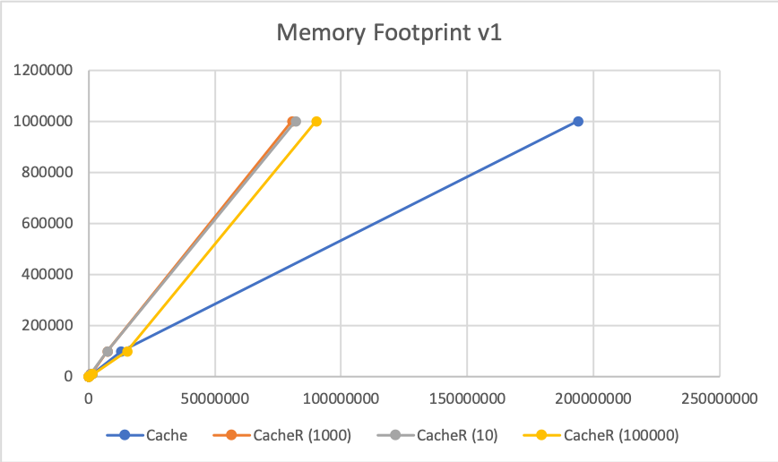

## Gocache

[](https://github.com/friendsofgo/gocache/actions)
[](https://godoc.org/github.com/friendsofgo/gocache)
[](https://goreportcard.com/report/github.com/friendsofgo/gocache)
[](https://friendsofgo.tech)

<p>
<a href="https://www.buymeacoffee.com/friendsofgo" target="_blank"></a>
</p>

Gocache is a **generic** in-memory cache implementation written in Go.

It requires Go v1.18+ due to the generics support.

## Table of Contents

1. [Data structures & algorithms](#data-structures--algorithms)
    1. [Boundless cache (HashMap)](#boundless-cache-hashmap)
    1. [LRU cache (HashMap + LinkedList)](#lru-cache-hashmap--linkedlist)
1. [Usage](#usage)
    1. [Boundless cache](#boundless-cache)
    1. [LRU cache](#lru-cache)
1. [Benchmarking](#benchmarking)
    1. [Time-cost - O(1)](#time-cost---o1)
    1. [Memory footprint](#memory-footprint)

### Data structures & algorithms

#### Boundless cache (HashMap)

Non-limited cache that uses a HashMap (`map[string]any`) under the hood.

Time cost analysis:

- Get (`O(1)`) = HashMap lookup (`O(1)`).
- Set (`O(1)`) = HashMap insert (`O(1)`).

#### LRU cache (HashMap + LinkedList)

Limited (with [LRU replacement](https://en.wikipedia.org/wiki/Cache_replacement_policies#Least_recently_used_(LRU))
cache that uses a HashMap(`map[string]any`) and a doubly-linked list under the hood.

Time cost analysis:

- Get (`O(1)`) = HashMap lookup (`O(1)`) + LinkedList relocation (`O(1)`).
- Set (`O(1)`) = HashMap insert (`O(1)`) + LinkedList insert (`O(1)`) + eviction (`O(1)`).
- eviction (`O(1)`) = HashMap deletion (`O(1)`) + LinkedList deletion (`O(1)`).

### Usage

#### Boundless

Just initialize a new cache and start using it through the `Get` and `Set` methods.

```go
package main

import "pkg.friendsofgo.tech/gocache"

func main() {
	key1, key2 := "key1", "key2"
	val1, val2 := 1, 2

	cache := gocache.NewBoundless[int]()
	cache.Set(key1, val1)
	cache.Set(key2, val2)

	cache.Get(key1) // returns: 1
	cache.Get(key2) // returns: 2
}
```

#### LRU cache

Just initialize a new cache with an initial size and start using it through the `Get` and `Set` methods.

```go
package main

import "pkg.friendsofgo.tech/gocache"

func main() {
	key1, key2 := "key1", "key2"
	val1, val2 := 1, 2
	size := 1

	cache := gocache.NewLRU[int](size)
	cache.Set(key1, val1)
	cache.Set(key2, val2)

	cache.Get(key1) // returns: nil (eviction)
	cache.Get(key2) // returns: 2
}
```

### Benchmarking

#### Time-cost - O(1)

As you you can see on the attached benchmark logs, the lookup time-cost of both implementations corresponds to O(1).

```
BenchmarkCache1-8                 	1000000000	         0.000000 ns/op
BenchmarkCache10-8                	1000000000	         0.000000 ns/op
BenchmarkCache100-8               	1000000000	         0.000000 ns/op
BenchmarkCache1000-8              	1000000000	         0.000000 ns/op
BenchmarkCache10000-8             	1000000000	         0.000000 ns/op
BenchmarkCache100000-8            	1000000000	         0.000001 ns/op
BenchmarkCache1000000-8           	1000000000	         0.000001 ns/op
BenchmarkLRU1x10-8             	1000000000	         0.000000 ns/op
BenchmarkLRU10x10-8            	1000000000	         0.000001 ns/op
BenchmarkLRU100x10-8           	1000000000	         0.000001 ns/op
BenchmarkLRU1000x10-8          	1000000000	         0.000000 ns/op
BenchmarkLRU10000x10-8         	1000000000	         0.000000 ns/op
BenchmarkLRU100000x10-8        	1000000000	         0.000000 ns/op
BenchmarkLRU1000000x10-8       	1000000000	         0.000001 ns/op
BenchmarkLRU1x1000-8           	1000000000	         0.000000 ns/op
BenchmarkLRU10x1000-8          	1000000000	         0.000001 ns/op
BenchmarkLRU100x1000-8         	1000000000	         0.000000 ns/op
BenchmarkLRU1000x1000-8        	1000000000	         0.000001 ns/op
BenchmarkLRU10000x1000-8       	1000000000	         0.000001 ns/op
BenchmarkLRU100000x1000-8      	1000000000	         0.000001 ns/op
BenchmarkLRU1000000x1000-8     	1000000000	         0.000001 ns/op
BenchmarkLRU1x100000-8         	1000000000	         0.000000 ns/op
BenchmarkLRU10x100000-8        	1000000000	         0.000000 ns/op
BenchmarkLRU100x100000-8       	1000000000	         0.000001 ns/op
BenchmarkLRU1000x100000-8      	1000000000	         0.000001 ns/op
BenchmarkLRU10000x100000-8     	1000000000	         0.000002 ns/op
BenchmarkLRU100000x100000-8    	1000000000	         0.000001 ns/op
BenchmarkLRU1000000x100000-8   	1000000000	         0.000001 ns/op
```

#### Memory footprint


